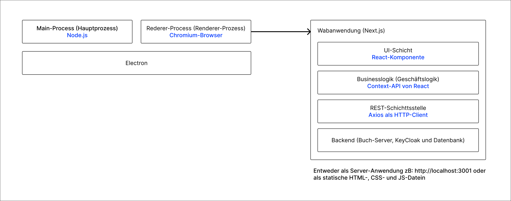

This is a [Next.js](https://nextjs.org/) project bootstrapped with [`create-next-app`](https://github.com/vercel/next.js/tree/canary/packages/create-next-app).

# Desktop-Anwendung mit Electron, NEXT.js und Material UI

## Inhalt

- [Installation](#installation)
- [Schnellstart](#schnellstart)
- [Architektur der Anwendung](#architektur-der-anwendung)
- [Electron](#electron)
- [Sicherheit](#sicherheit)
- [Sonstige Werkzeuge](#sonstige-werkzeuge)

## Installation

```bash
# Installation der Softwarepakete
npm install
```

### Umgebungsvariablen
Der Buch-Server muss gestartet sein und zwar auf _localhost_ und auf Port _3000_. Bei Port bzw. Host-Änderung, 
muss die Umgebungsvariable _NEXT_PUBLIC_BACKEND_SERVER_URL_ in der [.env](.env) Datei entsprechend angepasst werden. 

### CORS
Der Hostname und Port auf dem die Webanwendung läuft müssen in die Liste der zugelassenen Origins auf dem 
Buch-Server hinzugefügt werden, um CORS-Fehler zu vermeiden. Defaultmäßig läuft die Webanwendung auf http://localhost:3001

### Port der Webanwendung
Wenn die Webanwendung auf einem anderen Port laufen muss, kann dies in der Datei [package.json](package.json) gemacht werden. Dabei muss _3001_ in den npm-Skripten durch den neuen Port ersetzt werden. 


## Schnellstart

Webanwendung und Electron gleichzeitig in Entwicklungsmodus hochfahren
```bash
npm run electron:dev
```

Nur Webanwendung in Entwicklungsmodus hochfahren
```bash
npm run next:dev
```

Produktionsbündel der Anwendung(Web- und Electron-Anwendung) bauen. Dabei erst die Webanwendung dann die Electron-Anwendung gebaut.
```bash
npm run build
```

Produktionsbündel der Webanwendung starten.
```bash
npm run next:start
```

Produktionsbündel der ganzen Anwendung (Web- und Electron-Anwendung) starten.
```bash
npm run electron:start
```

Eslint
```bash
# Nach Formattierungsfehlern prüfen
npm run lint

# Formattierungsfehlern lösen (Wenn möglich)
npm run lint -- --fix
```

Prettier
```bash
npm run prettier
```

## Architektur der Anwendung



### Electron

ElectronJS ist ein Framework, mit dem man plattformübergreifende Desktop-Anwendungen mit 
JavaScript, HTML und CSS erstellen kann. Es basiert auf dem Chromium-Webbrowser und der Node.js-Plattform.

Man entwickelt die Benutzeroberfläche der Anwendung mit HTML, CSS und JavaScript, genau wie bei einer Webseite.
Electron bettet eine Chromium-Instanz ein, die die Webanwendung als native Anwendung ausführt.

1. **Der Hauptprozess (Node.js)**

Der eingebettete Node.js bietet eine Laufzeitumgebung für die Ausführung von JavaScript-Code 
außerhalb eines Webbrowsers. Er Ermöglicht auch den Zugriff auf native Systemfunktionen wie 
Dateisystem, Netzwerk und Prozessverwaltung. Desweiteren stellt er Module und APIs für die Entwicklung 
von serverbasierten Anwendungen bereit.
 
3. **Der Renderer-Prozess (Chromium):**

Bildet den Kern von Electron und stellt die Web-Engine dar. Chromium ermöglicht auch die 
Darstellung von HTML, CSS und JavaScript. Chromium kommuniziert mit dem eingebetteten 
Node.js (der Hauptprozess), wenn es Daten braucht.
Siehe: https://www.electronjs.org/docs/latest/tutorial/process-model

### **Vorteile von Electron**

- Plattformübergreifend
- Einfach zu erlernen, wenn  man bereits JavaScript kennt.
- Electron-Anwendungen können auf die volle Leistung des Chromium-Browsers und der Node.js-Plattform zugreifen.
- Große Community. Electron hat eine große und aktive Community, die viele Ressourcen und Bibliotheken zur Verfügung stellt.

### **Nachteile von Electron**

- Electron-Anwendungen sind in der Regel deutlich größer als native Anwendungen.
- Electron-Anwendungen können mehr Ressourcen (CPU, RAM) verbrauchen als native Anwendungen.
- Für komplexere Anwendungen kann die Entwicklung mit Electron eine Herausforderung werden.

### **Populäre Anwendungen, die mit Electron entwickelt sind**

- Visual Studio Code
- Microosft Teams
- Skype
- Figma
- Postman
- Discord
- Slack
- Twitch
- Atom
- Signal

## Sicherheit

Der Client meldet sich einmal an und bekommt einen Access-Token und Refresh-Token. 
Wenn der Access-Token abgelaufen ist, wird den Refresh-Token an den Server gesendet und 
er schickt einen neuen Access-Token und Refresh-Token als Response an den Client. 
Wenn aber die Tokens (Access-Token und Refresh-Token) alle abgelaufen sind, muss sich der Client nochmal anmelden.
So wird vermieden, dass Anmeldedaten (Benutzername und Passwort) ständig übertragen werden.

## Sonstige Werkzeuge

### CSS-Framework und Styles

- Material UI und Joy UI alle von Google (MUI: https://mui.com/joy-ui/getting-started/, JoyUI: https://mui.com/material-ui/getting-started/)
- Styled Components (https://styled-components.com/)

### HTTP-Client
- Axios (https://axios-http.com/)

### Sicherheit und Benutzerverwaltung (Serverseitig)
- KeyCloack (https://www.keycloak.org/)

### Hilfsmittel zum Laden von Daten in den React-Komponenten
- SWR (https://swr.vercel.app/docs/getting-started)

### Codequalität und -formatierung
- Eslint (https://eslint.org/)
- Prettier (https://prettier.io/)