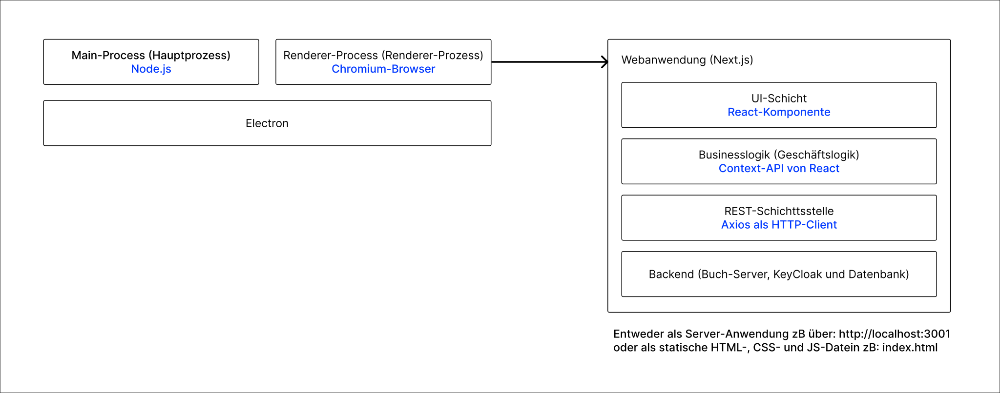

This is a [Next.js](https://nextjs.org/) 
project bootstrapped with 
[`create-next-app`](https://github.com/vercel/next.js/tree/canary/packages/create-next-app).

# Desktop-Anwendung mit Electron, NEXT.js und Material UI

## Inhalt

- [Installation](#installation)
- [Schnellstart](#schnellstart)
- [Architektur der Anwendung](#architektur-der-anwendung)
- [Electron](#electron)
- [Sicherheit](#sicherheit)
- [Sonstige Werkzeuge](#sonstige-werkzeuge)
- [Anmerkungen](#anmerkungen)

## Installation

```bash
# Installation der Softwarepakete
npm install
```

### Umgebungsvariablen

Der Buch-Server muss gestartet sein und zwar auf _localhost_ und auf Port _3000_. 
Bei Änderungen des Ports bzw. Hosts, auf dem der Buch-Server läuft, muss die Umgebungsvariable 
_NEXT_PUBLIC_BACKEND_SERVER_URL_ in der [.env](.env) Datei entsprechend auch angepasst werden. 

### CORS

Der Hostname und Port auf dem die Webanwendung läuft müssen in die Liste der zugelassenen Origins im 
Buch-Server hinzugefügt werden, um CORS-Fehler zu vermeiden. 
Defaultmäßig läuft die Webanwendung auf https://localhost:3001

### HTTPS

Die Webanwendung verwendet ein selbst-signiertes Zertifikat für HTTPS und zwar das gleiche Zertifikat wie das 
vom Buch-Server. Dafür folgende Schritte:

- Ertstelle einen Ordner namens <code>tls</code> im Verzeichnis [./src](./src).
- Kopiere das Zertifikat (<code>certificate.crt</code>) und den private Key (<code>key.pem</code>) aus dem 
Buch-Server-Projekt und füge sie in den vorher erstellten Ordner (<code>src/tls</code>) hinzu.

### Port der Webanwendung

Wenn die Webanwendung auf einem anderen Port als 3001 laufen soll, kann dies in der Datei [package.json](package.json) 
geändert werden. Dabei muss _3001_ in den npm-Skripten durch den neuen Port ersetzt werden. 


## Schnellstart

Webanwendung und Electron gleichzeitig im Entwicklungsmodus starten
```bash
npm run electron:dev
```

Nur Webanwendung im Entwicklungsmodus starten
```bash
npm run next:dev
```

Produktionsbündel der Anwendung(Web- und Electron-Anwendung) bauen. Dabei wird erst die 
Webanwendung dann die Electron-Anwendung gebaut. Die ausführbaren Datein (.exe) sind im Verzeichnis 
<code>/dist</code> generiert und gespeichert.
Die Electron-Anwendung wird mit dem Software-Paket [electron-builder](https://www.electron.build/index.html) gebaut 
und dabei ist eine Internetverbindung notwendig, da _electron-build_ sich die notwendigen Datein aus GitHub 
runterladen muss.
Dabei werden <code>next build</code> und <code>electron-builder --windows --x64</code> ausgeführt.
Führe <code>electron-builder --help</code> im Terminal aus, um weitere Optionen zu entdecken.

```bash
npm run build
```

Produktionsbündel der Webanwendung starten.
```bash
npm run next:start
```

Eslint
```bash
# Nach Formattierungsfehlern prüfen
npm run lint

# Formattierungsfehler lösen (Wenn möglich)
npm run lint -- --fix
```


## Architektur der Anwendung



### Electron

Electron ist ein Framework, mit dem man plattformübergreifende Desktop-Anwendungen mit 
JavaScript, HTML und CSS erstellen kann. Es basiert auf dem Chromium-Webbrowser und der Node.js-Plattform.

Man entwickelt die Benutzeroberfläche der Anwendung mit HTML, CSS und JavaScript, genau wie bei einer Webanwendung.
Electron bettet eine Chromium- und Node.js-Instanz ein.

1. **Der Hauptprozess (Node.js)**

Der eingebettete Node.js bietet eine Laufzeitumgebung für die Ausführung von JavaScript-Code 
außerhalb eines Webbrowsers. Er Ermöglicht auch den Zugriff auf native Systemfunktionen wie 
Dateisystem, Netzwerk und Prozessverwaltung. Desweiteren stellt er Module und APIs für die Entwicklung 
von serverbasierten Anwendungen bereit.
 
3. **Der Renderer-Prozess (Chromium):**

Bildet den Kern von Electron und stellt die Web-Engine dar. Chromium ermöglicht auch die 
Darstellung von HTML, CSS und JavaScript. Chromium kommuniziert mit dem eingebetteten 
Node.js (der Hauptprozess).
Siehe: https://www.electronjs.org/docs/latest/tutorial/process-model

### **Vorteile von Electron**

- Plattformübergreifend
- Einfach zu erlernen, wenn  man bereits JavaScript kennt.
- Electron-Anwendungen können auf die volle Leistung des Chromium-Browsers und der Node.js-Plattform zugreifen.
- Große Community. Electron hat eine große und aktive Community, die viele Ressourcen und Bibliotheken 
zur Verfügung stellt.

### **Nachteile von Electron**

- Electron-Anwendungen sind in der Regel deutlich größer als native Anwendungen.
- Electron-Anwendungen können mehr Ressourcen (CPU, Arbeitsspeicher) verbrauchen als native Anwendungen.
- Für komplexere Anwendungen kann die Entwicklung mit Electron eine Herausforderung werden.

### **Populäre Anwendungen, die mit Electron entwickelt sind**

- Visual Studio Code
- Microsoft Teams
- Skype
- Figma
- Postman
- Discord
- Slack
- Twitch
- Atom
- Signal

## Webanwendung

Die Webanwendung ist mit dem Framework [Next.js](https://nextjs.org/) entwickelt.
Die Webanwendung besteht aus 3 Schichten nämmlich die UI-Schicht, 
die Businesslogik (Geschäftslogik) und die HTTP-Schicht.

1. **UI-Schicht**

Diese Schicht stellt die Benutzeroberfläche (UI) der Anwendung dar. React-Komponente, 
HTML und alle Interaktionen mit dem [DOM](https://developer.mozilla.org/en-US/docs/Web/API/Document_Object_Model), 
CSS und alle Benutzer-Interaktionen mit der Anwendung sind Komponenten dieser Schicht. 
Diese Schicht greift auf die Businesslogikschicht zu, 
wenn der Benutzer eine Schreib- oder Leseoperation tätigt.

2. **Businesslogik**

Die Businesslogik ist das Herz der Anwendung. Diese Schicht ist verantwortlich 
für z.B: die Verarbeitung von Daten, die Vorbereitung von Daten für 
Schreib- und Leseoperationen, die Umwandlung von Daten aus der HTTP-Schicht
vor und nach Schreib- und Leseoperationen, oder Abfangen von Fehlern aus der HTTP-Schicht. 
Die [Kontexte](https://react.dev/learn/passing-data-deeply-with-context)
stellen in dieser Webannwendung die Businesslogik dar 
und sind unter [./src/context/](./src/context/) zu finden.

3. **HTTP-Schicht**

Die HTTP-Schicht ist der Vertreter nach außen. Diese Schicht hat die Veranwortung, 
Anfragen an externe Dienste bzw. Datenquellen zu senden und Antworten auf die Anfragen zu empfangen.

## Sicherheit

Der Client meldet sich einmalig an und erhält einen Access-Token und einen Refresh-Token. 
Wenn der Access-Token abgelaufen ist, sendet der Client den Refresh-Token an den Server. Der Server erhält den 
Refresh-Token, prüft ihn und schickt einen neuen Access-Token und Refresh-Token als Response an den Client zurück. 
Wenn aber die Tokens (Access-Token und Refresh-Token) alle abgelaufen sind, 
muss sich der Client erneut anmelden und der Prozess wiederholt sich.
Dadurch wird verhindert, dass die Anmeldedaten (Benutzername und Passwort) ständig übertragen werden.

## Sonstige Werkzeuge

### CSS-Framework und Styles

- Material UI und Joy UI alle von Google 
(MUI: https://mui.com/joy-ui/getting-started/, JoyUI: https://mui.com/material-ui/getting-started/)
- Styled Components (https://styled-components.com/)

### HTTP-Client
- Axios (https://axios-http.com/)

### Sicherheit und Benutzerverwaltung (Serverseitig)
- KeyCloack (https://www.keycloak.org/)

### Hilfsmittel zum Laden von Daten in den React-Komponenten
- SWR (https://swr.vercel.app/docs/getting-started)

### Codequalität und -formatierung
- Eslint (https://eslint.org/)
- Prettier (https://prettier.io/)

## Anmerkungen

- Der neue [App Router](https://nextjs.org/docs/app) funktioniert nicht mit Electron (technisch gesehen schon, aber es gibt einige 
Probleme und Bugs, vor allem weil Next.js die statischen HTML-, CSS- und JavaScript-Datein - exportieren muss, 
anstatt NodeJS hinter den Kulissen auszuführen). Aus diesem Grund wurde der [Pages Router](https://nextjs.org/docs/pages) fürs Routing verwendet.

- Electron "rendert" hier lediglich eine statische Webseite in einem nativen Fenster des Betriebssystems. 
Backend-Funktionen von NextJS (z.B. getStaticProps, App Router, NextAuth oder API-Routen) 
funktionieren leider nicht, da sie als statisch exportiert werden müssen, anstatt eine NodeJS-Laufzeitumgebung 
hinter der Anwendung auszuführen. Wenn man Backend-Aufgaben erledigen muss, versucht man, 
diese auf dem [Hauptprozess](Electron) von Electron auszuführen, anstatt sie an NextJS zu delegieren.

- Beim Bauen (_npm run built_) der Webanwendung, werden statische Datein (HTML, CSS und JavaScript) generiert. 
Dies kann unter [next.config.mjs](next.config.mjs) eingestelt werden...